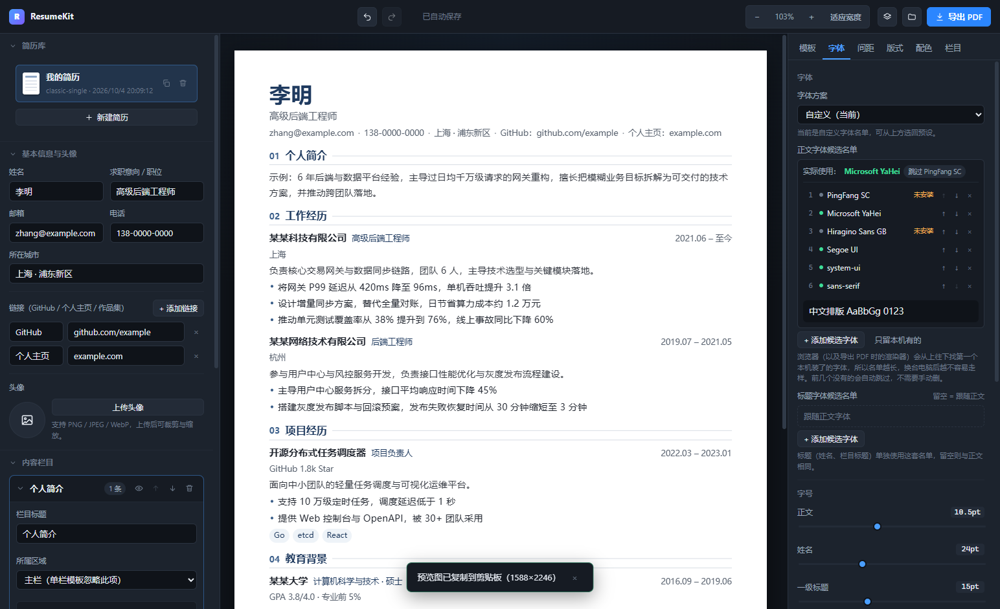
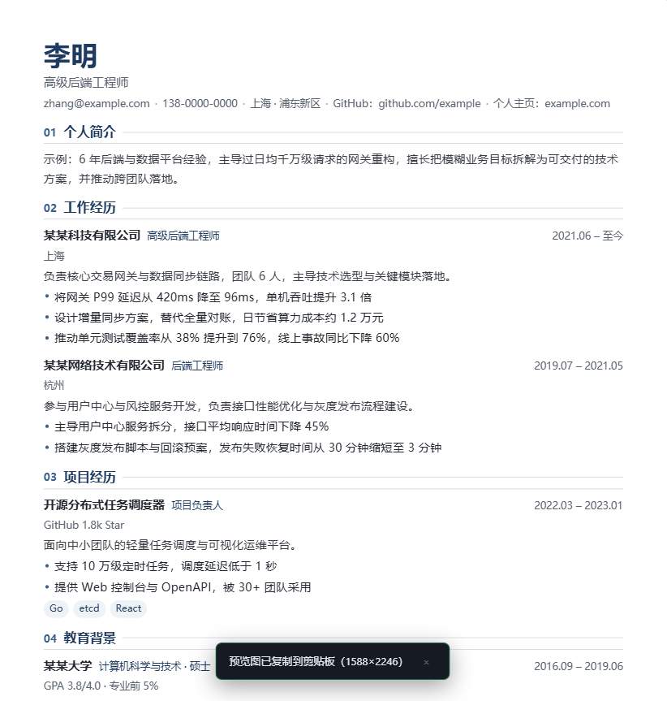

# ResumeKit

A desktop resume builder for Windows. Five built-in templates, every typographic token adjustable, and a PDF export that matches the on-screen preview page for page — with selectable, searchable Chinese text.

Built with Electron 44 + React 19 + TypeScript + Vite (electron-vite).

> **The application UI is in Chinese.** This README is in English for the GitHub audience. Template content is language-agnostic — you can write a resume in any language.

---

## Screenshots



*Left: resume library and content editor. Center: A4 preview with page-break guides. Right: the six parameter panels.*



*A page rendered from the reference template — this is what the exported PDF looks like.*

---

## Features

- **5 templates** — classic single column, modern two column, compact tech, elegant serif, bold timeline. Switching templates never loses content.
- **Everything is a token** — font size, line height, letter spacing, font weight, page margins, section spacing, item spacing, sidebar width, column gap, rule weight, accent bar, corner radius, nine colors. Templates only consume these tokens, so every template automatically supports every parameter.
- **Font stacks you can actually read** — the font panel lists each candidate font by name, detects which ones are really installed on your machine (green dot vs. "not installed"), tells you which one is actually in effect, and lets you reorder or drop layers.
- **PDF export** — A4, print margins fully controlled by your tokens, fonts embedded, Chinese text selectable and searchable.
- **Copy preview as PNG** — renders the resume at 2× pixel density straight into the system clipboard, ready to paste into a chat or a document.
- **Multiple resumes** — create, duplicate, rename, delete; content autosaves to disk.
- **Avatar upload with cropping** — pan and zoom on a canvas, output as circle / rounded / square.
- **Undo/redo** and full keyboard shortcuts.
- **WYSIWYG pagination** — the preview's page count and page-break guides come from real print-layout measurement, so they match the PDF.
- **Local only** — nothing is uploaded anywhere; all data lives in your user data directory.

---

## Getting started

```bash
npm install          # install dependencies
npm run dev          # dev mode with hot reload
npm run build        # build to out/
npm start            # run the built output
npm run typecheck    # type-check main + renderer
```

If `node_modules/electron/dist/electron.exe` is missing after `npm install`, the Electron binary failed to download. Behind a slow network, set a mirror and re-run:

```powershell
$env:ELECTRON_MIRROR='https://npmmirror.com/mirrors/electron/'
node node_modules/electron/install.js
```

---

## Packaging

```bash
npm run dist         # installer + portable build into release/
npm run dist:dir     # unpacked directory only (fastest)
```

Artifacts (unpacked directory 368 MB; installer and portable build ~106 MB each):

| File | Description |
|---|---|
| `release/ResumeKit Setup 0.1.0.exe` | NSIS installer — choose install directory, creates a desktop shortcut |
| `release/ResumeKit 0.1.0.exe` | Portable single-file build — just double-click, easy to hand to someone |
| `release/win-unpacked/ResumeKit.exe` | Unpacked build — fastest start, easiest to debug |

The **first packaging run needs network access** to download the NSIS and winCodeSign toolchains (~10 MB). Behind a slow network:

```powershell
$env:ELECTRON_MIRROR='https://npmmirror.com/mirrors/electron/'
$env:ELECTRON_BUILDER_BINARIES_MIRROR='https://npmmirror.com/mirrors/electron-builder-binaries/'
npm run dist
```

### Launching a packaged build from a shell

If your terminal has `ELECTRON_RUN_AS_NODE=1` set (some IDEs, debuggers and toolchains set it), the executable is treated as **plain Node** and silently exits with code 0 — no window, no startup log. This is not an application bug; **double-clicking from Explorer is unaffected**. Clear it first:

```powershell
Remove-Item Env:ELECTRON_RUN_AS_NODE -ErrorAction SilentlyContinue
& '.\release\ResumeKit 0.1.0.exe'
```

### Troubleshooting a packaged build

If double-clicking does nothing, enable the startup log and launch again:

```powershell
$env:RESUMEKIT_BOOT_LOG='1'
& '.\release\win-unpacked\ResumeKit.exe'
Get-Content "$env:APPDATA\ResumeKit\boot.log"
```

The log is written to `<APPDATA>/ResumeKit/boot.log` and records module load (`isPackaged`, Electron/Node version, asar path), the single-instance lock, store initialization, IPC registration, window creation, page load, preload errors, plus uncaught exceptions and unhandled rejections. It is off by default and performs no I/O unless enabled. Implementation: `src/main/boot-log.ts`.

### Customizing the build

- **Icon** — put an `icon.ico` (256×256 recommended) in `build/`. That directory does not exist yet; create it. Without it, Electron's default icon is used.
- **Skip the installer** — edit `build.win.target` in `package.json` and keep only `portable` or `nsis`.
- **Code signing** — currently unsigned, so Windows SmartScreen shows an "unknown publisher" warning on first run. Removing it requires a code-signing certificate configured under `build.win` (e.g. `certificateFile` / `certificatePassword`).
- **Other platforms** — only Windows targets are configured. macOS/Linux need `mac` / `linux` sections and should be packaged on those systems.

---

## The application

Three panes; every edit updates the preview immediately and autosaves.

| Pane | Contents |
|---|---|
| Left | Resume library (new / duplicate / delete), basic info and avatar, content section editor, resume file name |
| Center | A4 preview, page count and page-break guides, zoom controls |
| Right | Six parameter panels: Template / Font / Spacing / Layout / Colors / Sections |

### Keyboard shortcuts

| Shortcut | Action |
|---|---|
| `Ctrl+Z` / `Ctrl+Shift+Z` | Undo / redo |
| `Ctrl+S` | Save now (normally autosaves) |
| `Ctrl+E` or `Ctrl+P` | Export PDF |
| `Ctrl+Shift+C` | Copy preview image to clipboard |
| `Ctrl+=` / `Ctrl+-` | Zoom in / out |
| `Ctrl+0` | Fit to width |
| `Ctrl` + wheel | Zoom preview |

### Templates

| Template | Layout | Best for |
|---|---|---|
| Classic Single | Single column | Conservative, government and state-owned employers |
| Modern Sidebar | Light left sidebar | Balancing information density and readability |
| Compact Tech | Narrow right sidebar | Engineering roles — pack more projects into one page |
| Elegant Serif | Single column, centered header | Academia, education, law, consulting |
| Bold Timeline | Single column + accent bars | Tech and design, emphasizing progression |

Switching templates **keeps** your current font, spacing and color tokens. To return to a template's original design, click "Apply this template's recommended style".

> In the two-column templates the name and contact line appear both at the top of the sidebar and at the top of the main column. That duplication is intentional — it keeps the sidebar readable on its own.

### Parameters

Every adjustable value is a **theme token**; templates consume tokens and emit CSS variables, so any template automatically gains every parameter. Tokens are grouped as `typography`, `colors`, `spacing`, `layout` and `avatar`.

| Panel | What you can adjust |
|---|---|
| Font | Font presets, body/heading candidate font stacks, per-level font sizes, line height, letter spacing, font weights, heading casing |
| Spacing | Page margins, sidebar padding, section gap, item gap, paragraph gap, bullet gap |
| Layout | Sidebar width, column gap, heading gap, rule weight, accent bar width, corner radius, avatar size/shape/position |
| Colors | 5 preset palettes + 9 individually adjustable colors |
| Sections | Show/hide, rename, reorder, main/sidebar assignment |

Font sizes use `pt` (matching print); spacings use `px` (mapping to A4 at 96 dpi).

#### How fonts are chosen

A CSS `font-family` is not a single font — it is a **priority-ordered candidate list**:

```
'Inter','PingFang SC','Microsoft YaHei',…,sans-serif
```

The renderer walks the list and uses the first one installed on the system. **Different systems ship different fonts**, so a longer list means a resume is less likely to look wrong when opened elsewhere.

You never have to deal with that CSS string. The font panel renders the list as one font name per row and **detects whether each font is actually installed** (by comparing rendered text width against a non-existent font — no extra dependency):

| Marker | Meaning |
|---|---|
| Green dot + font name | Installed here; will actually be used |
| Amber "not installed" | Missing here; only takes effect on machines that have it (harmless to keep) |
| "In use: xxx" at the top | The first font in this list that really resolves |
| "skipped xxx" badge | The first entry is not installed here |
| ↑ ↓ × per row | Reorder priority, remove from the list |
| "+ Add candidate font" | Pick from the built-in candidate table (installed ones first), or type any font name |
| "Keep only installed" | Drop every layer that is missing on this machine |

Each list has a Chinese preview line underneath so you can see how the stack actually renders.

> The built-in candidate table covers ~30 common Latin and CJK fonts; it is not an enumeration of every system font. For anything else, type the font name into "+ Add candidate font".
>
> For example the "Modern Sans" preset starts with Inter; if you don't have it, the panel shows "In use: Microsoft YaHei" and flags "skipped Inter".

### Section types

Summary, experience, education, projects, skills, certifications, languages, awards, and custom sections. Each type exposes only its relevant fields (a "skills" section asks for name/level/description; an "experience" section gets a bullet list), and new sections come with sample content.

---

## Export

**Export PDF** (`Ctrl+E`) renders in a hidden window and calls Chromium's `printToPDF`:

- A4; page margins are fully controlled by your tokens — the printer adds no extra margin;
- fonts are embedded, and Chinese text can be copied and searched in any PDF reader;
- the page count matches the page-break guides shown in the preview.

**Copy preview image** (`Ctrl+Shift+C`) rasterizes the current resume at 2× pixel density into the system clipboard as PNG, ready to paste into a chat window or document.

> Pagination in the preview is measured by laying out the document at A4 width with **print styles** inside a hidden iframe, so the preview's page count is the PDF's page count. The preview stage carries a `data-rs-pagination` attribute (print height, screen height, mapping ratio) you can inspect in DevTools.

---

## Data location

Everything is local; nothing is uploaded:

```
%APPDATA%\ResumeKit\             ← open it with the folder button in the title bar
├── resumes\
│   ├── index.json               ← resume list and last-opened entry
│   └── <resumeId>.json          ← one file per resume
└── exports\                     ← suggested directory for exported PDFs (created on first export)
```

Writes use "temp file + atomic rename" so an interrupted write cannot corrupt an archive. If the index is damaged it is rebuilt by scanning `resumes/`.

Avatars are stored as data URLs inside the resume file, so copying a resume file is a complete backup (avatar included).

> The directory name comes from `productName` in `package.json`; without it, it falls back to the lowercase package name `resumekit`.

---

## Code structure

```
src/
├── main/                      Electron main process
│   ├── index.ts               window, lifecycle, IPC registration
│   ├── storage.ts             resume library I/O (atomic writes, index rebuild)
│   ├── export-pdf.ts          hidden-window render + printToPDF
│   └── boot-log.ts            optional startup step log (debugging packaged builds)
├── preload/index.ts           narrow contextBridge surface
├── shared/                    shared by main and renderer (zero dependencies)
│   ├── resume.ts              data model + A4 constants
│   ├── theme.ts               theme tokens, font presets, tokens → CSS variables
│   ├── samples.ts             sample content and new-section factories
│   └── ids.ts                 id generation and cloning
└── renderer/src/
    ├── App.tsx                three-pane shell, title bar, shortcuts
    ├── store/useResumeStore.ts  zustand state, autosave, undo/redo
    ├── templates/             template system
    │   ├── catalog.ts         template metadata and recommended tokens
    │   ├── blocks.tsx         shared content blocks (header/item/section/layout)
    │   ├── designs.tsx        the five template layouts
    │   └── index.tsx          pairs catalog entries with render functions
    ├── components/            UI (preview, pagination, inspector, editors, cropper, font picker)
    ├── lib/                   font-availability (font detection), canvas-export (DOM → canvas → PNG)
    └── styles/                base / components / template
```

### Adding a template

1. Append metadata (including a `defaults` token patch) in `templates/catalog.ts`;
2. Write the layout component in `templates/designs.tsx`, composing content blocks via `splitSections` + `Section`;
3. Register it in `RENDERERS` in `templates/index.tsx`.

All styling lives in `styles/template.css` and may only use `--rs-*` variables — that is what gives a new template every adjustable parameter for free and keeps preview and export on the same rules.

---

## Testing

Both suites drive the real main-process build; nothing is mocked at the unit level.

### Source build

```bash
npm run build
npm run probe
```

`scripts/probe/probe.cjs` loads the **actual built main-process artifact**, stubs the save dialog, then drives the real UI through **50 assertions**:

- whether the preload bridge is wired (`window.api` and its IPC methods);
- whether React renders the resume, A4 and padding tokens, the template gallery, the parameter panels and the section editor;
- whether switching templates and changing font-size tokens take effect immediately, and whether a two-column sidebar matches its token width and stretches to a full page;
- the font panel: candidate list rendered per layer, missing fonts flagged, and removing a layer updating the font family actually applied to the template;
- the pagination chain: enlarging the font really adds a page, and the number of break guides matches the page count;
- the export chain: clicking the in-app export button produces an A4 single-page PDF with fonts embedded, and **its page count matches the preview**;
- PDF text recovery (`scripts/probe/pdf-text.py`, decoding content streams through the ToUnicode CMaps) confirming Chinese is really in the file and searchable;
- reading the clipboard back after "copy preview image" to confirm it holds `image/png`;
- whether the index and resume files land on disk.

Artifacts go to `.scratch/` (including `app-window.png` and `resume-a4.png` for eyeballing the layout). The directory is rebuilt on every run and can be deleted safely.

> The probe needs a working Python (it uses `RS_PYTHON` / `PYTHON`, or `python` on PATH) to decode PDF text. When unavailable it skips that check with a notice and the remaining assertions still run.

### Packaged build

```bash
npm run dist:dir        # produce release/win-unpacked first
npm run probe:packaged  # then verify that artifact (18 assertions)
```

`scripts/probe/packaged-smoke.cjs` loads the packaged main process directly out of `app.asar` using the development Electron binary, and checks:

- that the asar contains the main entry, renderer entry and preload script;
- that the packaged main process creates a window, renders the UI, exposes a working preload bridge and applies the A4 token;
- that clicking export inside the packaged build produces an A4 single-page PDF with embedded fonts and searchable Chinese.

The difference from `probe` is what is under test: `probe` covers the source build, `probe:packaged` covers **what ended up inside the asar** — which is what catches the "a file was left out of the package" class of bugs.

### Focused verification

```bash
npm run build
electron scripts/probe/multipage-sidebar.cjs
```

`scripts/probe/multipage-sidebar.cjs` reproduces the first known limitation: it switches to a two-column template and pushes the font size to 14pt to force two pages, then counts the sidebar sections visible on each page and writes a screenshot to `.scratch/multipage/`. The conclusion is reproducible rather than assumed — currently page 1 holds the sidebar sections and page 2's sidebar column is empty.

---

## Known limitations

- **Sidebar sections only appear on the first page.** With a two-column template, if the content exceeds one page the sidebar background stretches across the whole document, but sidebar sections (skills, languages, certifications) are laid out on page 1 only — page 2's sidebar column is blank. Reproduce with `scripts/probe/multipage-sidebar.cjs`. If your sidebar content does not fit on one page, move those sections to the main column or use a single-column template.
- **Section placement is explicit configuration.** The main/sidebar toggle only affects two-column templates; single-column templates simply stack every enabled section in order.
- **No automatic pagination optimization.** When content overflows a page, the preview marks the break with a red dashed line and the page count changes, but the tool will not shrink content or font size for you — adjust the Spacing / Font panels yourself.
- **Copy-preview-image relies on DOM rasterization.** If the resume references a cross-origin image, copying reports an explicit error and suggests using PDF export instead; it never silently produces an image with missing pictures.
- **The font candidate table is not every system font.** About 30 common fonts are probed and recommended; anything else must be typed in by name.
- **Windows only.** Targets are `nsis` + `portable`.

---

## Implementation notes

- **The preload script must be CommonJS with a `.cjs` extension.** `package.json` declares `"type": "module"`, so a `.js` preload is loaded as ESM and fails with `require is not defined`, taking down the entire bridge (the UI renders blank).
- **PDF export and the preview share `styles/template.css`.** The main process inlines that file as text via `?raw`, so styles are maintained in one place and cannot drift between preview and print.
- **Pagination cannot be measured from the screen layout.** Screen and print media round line heights differently; deriving pages from the screen layout produces "preview says 2 pages, export produces 1". Measurement happens in a hidden iframe that carries the same CSS under `media="print"` at A4 width, and break positions are mapped back to screen coordinates by height ratio.
- **Attach the load listener before calling `loadURL` when exporting.** A `data:` URL can finish loading before `loadURL` resolves; the other order permanently misses `did-finish-load` and every export times out.
- **`productName` must be set explicitly in the root `package.json`.** Electron reads it to decide the `userData` path and window title; putting it only in electron-builder's `build` section does not inject it into the asar's package.json, so data lands in a lowercase package-name directory.

---

## License

No license file is included yet. Without one, the code is "all rights reserved" by default — add a `LICENSE` (MIT is a common choice for tools like this) if you intend others to reuse it.
